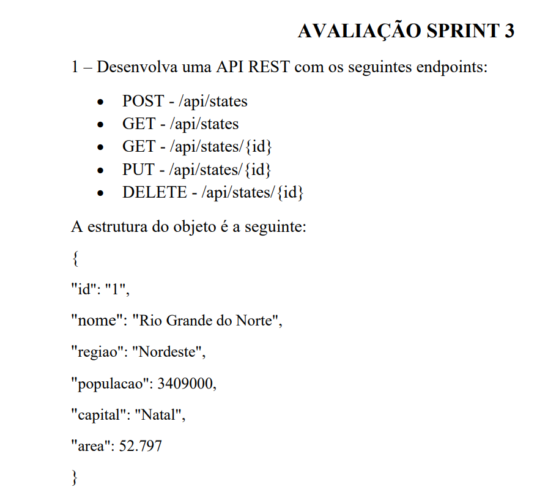
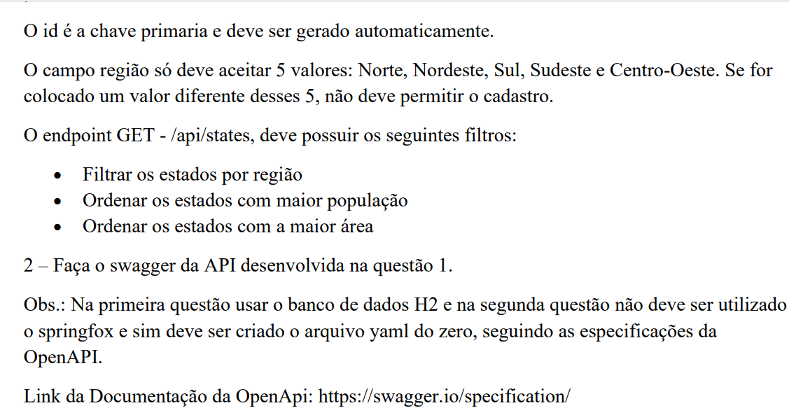
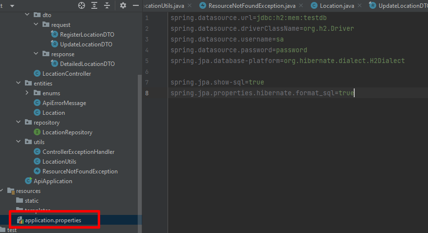
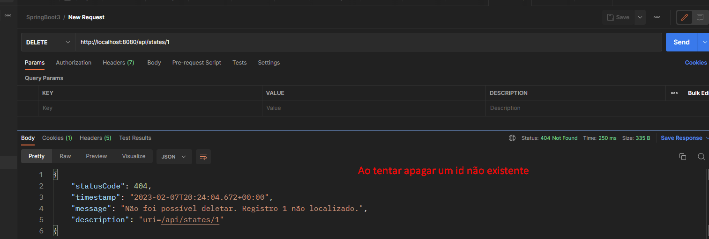
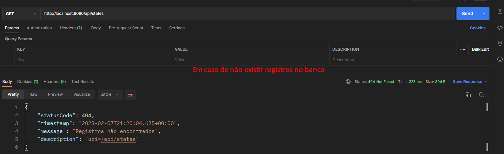
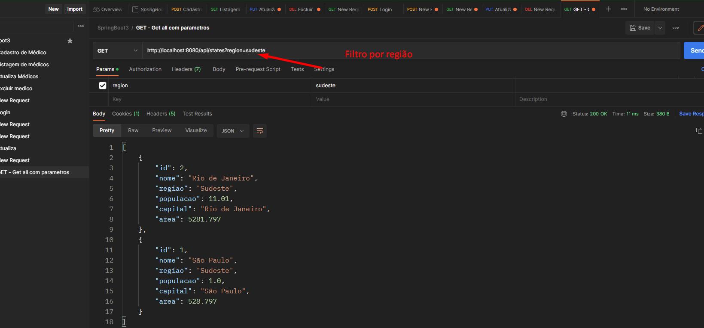

# Sprint 03 SpringBoot

## Desafio proposto




### Execução 

A API utiliza o banco H2, utilizei a configuração padrão do mesmo no arquivo 
.properties, conforme imagem.



### POST Body
```json
{ 
"nome": "Paraná", 
"regiao": "Sul", 
"populacao": 100990.000, 
"capital": "Curitiba", 
"area": 528880.797 
}

```
### Validações

A API não permite registros duplicados (por nome), não registra em caso de erro ortográfico ou
em caso de estar faltando algum atributo no json entre outras, conforme abaixo.





### Filtrando por estado

