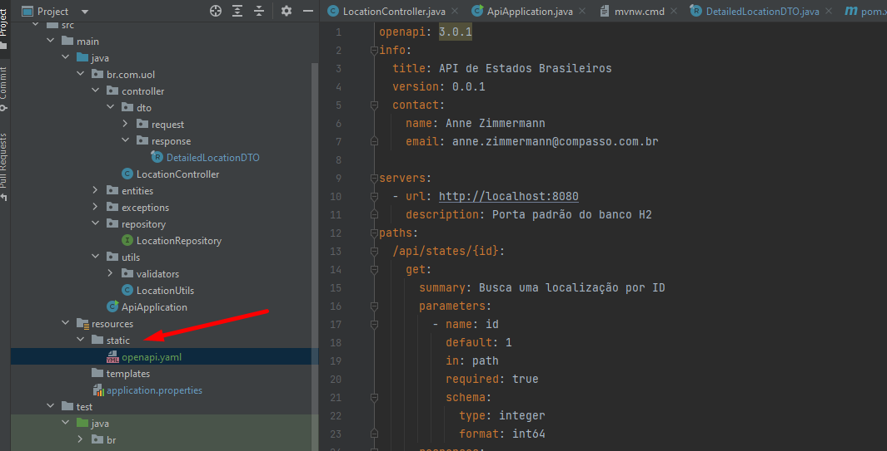

# Sprint 03 SpringBoot

## Desafio proposto


## Tecnologias:
- Maven
- SpringBoot 3

### Execução 

A API utiliza o banco H2, utilizei a configuração padrão do mesmo no arquivo 
.properties, conforme imagem.


### POST Body
```json
{ 
"nome": "Paraná", 
"regiao": "Sul", 
"populacao": 100990.000, 
"capital": "Curitiba", 
"area": 528880.797 
}

```

# OpenAPI

### Open API 3.0.1

Executar o projeto e acessar a documentação no link abaixo. (se subiu em outra porta, alterar)

http://localhost:8080/swagger-ui/index.html#/

O Arquivo yaml pode ser encontrado em:

src/main/resources/static/openapi.yaml




OBS: Coloquei alguns valores default no documento (apenas para uma melhor visualização)

### Validações

A API não permite registros duplicados (por nome), não registra em caso de erro ortográfico ou
em caso de estar faltando algum atributo no json entre outras, conforme abaixo.


### Filtrando por estado


